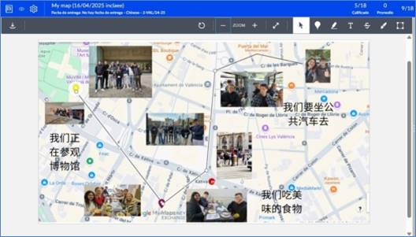
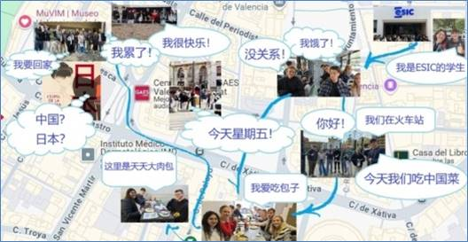

# Map Overview

## Description

This section presents selected views of the learner-generated urban trail created through Google Maps during the Urban Linguistic Landscapes project.

The map combines geolocated photographs, Chinese-language productions, and narrative elements associated with specific locations visited during the Jane’s Walk activities.

The resulting artefact documents how learners connected language use, cultural observation, and urban exploration within a shared digital environment.

## Map View 1

### Observed Features

The first map view illustrates how learners connected Chinese-language production to specific urban locations visited during the Jane’s Walk activities. The geolocated entries combine photographs, route information, and short Chinese texts describing actions and experiences associated with particular places.

Several entries focus on everyday activities such as visiting a museum, using public transport, or eating local food. Rather than presenting decontextualised vocabulary items, the map situates language within meaningful spatial and social contexts. The resulting artefact links linguistic production to concrete experiences, enabling learners to document and interpret the urban environment through the target language.

The map also demonstrates the integration of multiple semiotic resources, including visual, textual, and spatial elements. Meaning is constructed not only through the Chinese texts themselves but also through their relationship with photographs, locations, and movement across the city.

From a pedagogical perspective, the artefact illustrates how language learning can become embedded within authentic urban experiences. Rather than treating language as an isolated object of study, learners used Chinese to document actions, interpret places, and represent their encounters with the city. The resulting entries suggest an emerging ability to connect linguistic production with situated observation and spatial meaning-making.

## Map View 2

### Observed Features

The second map view reveals a more personal and narrative-oriented use of the urban trail. Rather than merely documenting locations, learners associated specific places with first-person statements, emotions, preferences, and everyday experiences expressed in Chinese.

Several entries refer to personal identity, mobility, emotional states, and food preferences, including statements such as being a student, travelling through the city, feeling happy or hungry, and expressing preferences for particular foods. These contributions transform the map from a record of visited locations into a multimodal representation of lived experience.

The artefact illustrates how learners used the target language to construct personal narratives within authentic urban settings. By linking geolocated photographs to first-person statements, the map creates a form of situated storytelling in which language, place, and experience become closely interconnected.

From a pedagogical perspective, the map extends beyond the identification of linguistic landscape elements and encourages learners to interpret, personalise, and communicate their encounters with the urban environment. The resulting entries suggest an emerging ability to use Chinese not only to label places but also to express personal perspectives and experiences associated with them.

## Evidence of Learning

[To be completed]

## Reuse Potential

[To be completed]

