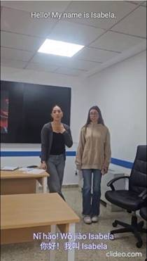
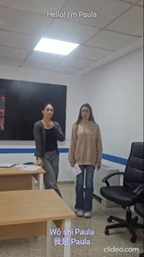
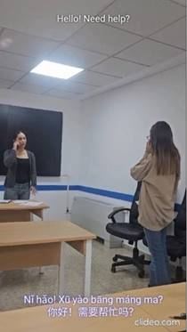
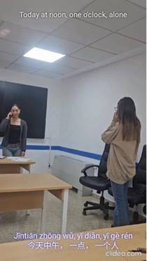
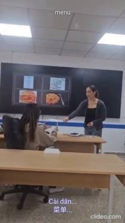
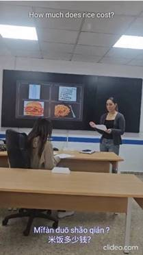
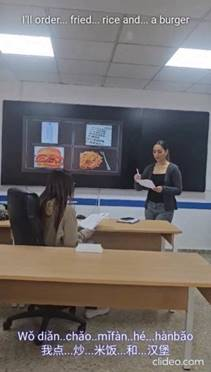
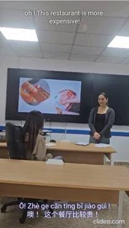

# Restaurant Role-Play

## Overview

This learner-generated artefact was created as part of a task-based activity designed to simulate an authentic restaurant interaction in Chinese.

Working collaboratively, students planned, rehearsed, recorded, and subtitled a short video representing a realistic communicative situation. The final artefact combined oral production, visual communication, and written support through subtitles in both Chinese characters (hanzi) and pinyin.

## Learning Context

* Language: Chinese as a Foreign Language
* Proficiency level: A1
* Task type: Role-play and multimodal production
* Learning environment: Urban Linguistic Landscapes Project

## Learning Objectives

* Use basic Chinese expressions in a restaurant context.
* Develop oral interaction skills.
* Apply appropriate pragmatic conventions.
* Create multimodal content for an audience.
* Produce educational resources with potential value for future learners.

## Artefact

[Video link to be added]

## Visual Sequence

### Still 1

### Still 2

### Still 3

### Still 4

### Still 5

### Still 6

### Still 7

### Still 8

## Evidence of Learning

The artefact illustrates learners’ ability to organise a complete restaurant interaction through a sequence of communicative actions, including self-introduction, table reservation, menu consultation, price inquiry, food ordering, and payment.

Although the linguistic repertoire remains consistent with an A1 level of proficiency, the video demonstrates the learners’ capacity to use Chinese for meaningful communicative purposes within a coherent service encounter. The progression across the eight stills shows how participants linked individual speech acts into an extended interaction rather than producing isolated utterances.

A notable feature of the artefact is the incorporation of subtitles in both Chinese characters (hanzi) and pinyin. These multimodal elements function as comprehension scaffolds that may support access for novice learners while simultaneously increasing the educational value of the resource for potential future users.

The artefact also provides evidence of audience awareness. Rather than creating a task product intended exclusively for assessment, learners produced a multimodal resource designed to be viewed and understood by others. This orientation towards accessibility and comprehensibility is reflected in the inclusion of visual cues, subtitles, and clearly sequenced communicative exchanges.

Taken together, these features suggest the development of communicative, digital, and multimodal competences and illustrate how learner-generated artefacts can serve as educational resources with potential value beyond the immediate classroom context.

## Reuse Potential

The artefact was analysed as a learner-generated resource with potential educational value beyond its original instructional context. Although actual reuse by third parties was not investigated, several characteristics support its reuse potential.

First, the role-play addresses a highly transferable communicative situation frequently included in introductory Chinese language curricula. Restaurant interactions constitute a common learning objective at beginner levels and can therefore be adapted to different teaching contexts.

Second, the artefact combines oral language, visual representation, and written support through subtitles in both pinyin and Chinese characters. This multimodal design may facilitate comprehension for novice learners and provides multiple points of access to meaning.

Third, the sequence follows a clearly identifiable communicative structure, including greeting, reservation, menu consultation, price enquiry, ordering, and payment. The transparency of this progression may support its use as a model, discussion prompt, observation task, or role-play stimulus.

Finally, the artefact illustrates how learners can act not only as language users but also as creators of educational content. In this sense, its value lies not only in the linguistic interaction it represents but also in its potential to exemplify learner-generated OER practices within task-based and open pedagogical approaches.

For these reasons, the artefact can be considered a resource with reuse potential, while recognising that its actual adoption and reuse by external users would require separate empirical investigation.

## Related Competences

* Linguistic competence
* Mediation
* Digital competence
* Multimodal literacy
* Intercultural awareness
