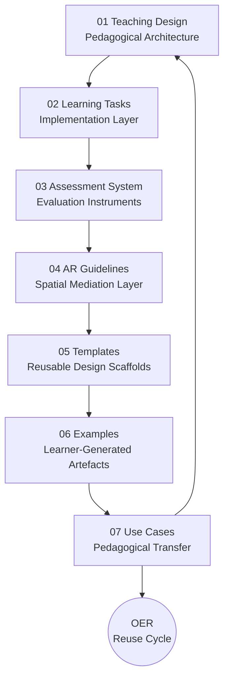
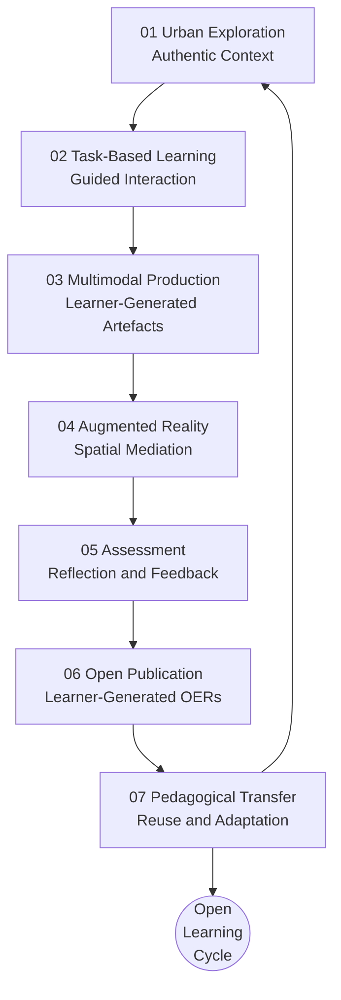

# 🌍 Urban Linguistic Landscape OER  
## Task- and Project-Based Chinese Learning (A1–A2)

---

## 🧭 Overview

This repository presents a research-based Open Educational Resources (OER) system for beginner Chinese (A1–A2 CEFR level).

It integrates:

- Urban Linguistic Landscapes (ULL)
- Task- and project-based learning
- Multimodal production and mediation
- Augmented Reality (AR) as a mediational layer
- Open Educational Practices (OEP)

The system is designed as a **cyclical pedagogical architecture**, where learning design, learner activity, and research evidence are structurally interconnected.

---

## 👥 Who Is This Repository For?

This repository has been designed to support three complementary user profiles, each with different goals and recommended entry points.

### 🔬 Researchers

Begin with **[`00_Theory`](00_theory/)** and **[`01_Teaching_Design`](01_teaching_design/)** to explore the conceptual foundations, instructional model, research methodology, and analytical framework underpinning the project.

### 👩‍🏫 Teachers

Begin with **[`02_Learning_Tasks`](02_learning_tasks/)** and **[`05_Templates`](05_templates/)** for ready-to-use learning activities, adaptable instructional resources, and reusable production scaffolds. Then continue with **[`07_Use_Cases`](07_use_cases/)** to explore implementation guidance, adaptation strategies, and examples of pedagogical transfer across languages, educational levels, and teaching contexts.

### 🎓 Students

Begin with **[`02_Learning_Tasks`](02_learning_tasks/)** for task instructions and learning objectives. Then explore **[`06_Examples`](06_examples/)** to examine authentic learner-produced artefacts and better understand the expected outcomes of each activity.

---

## 🧠 System architecture

The repository is organised into seven interconnected modules plus a theoretical foundation:

- 00 → Theory and conceptual framework  
- 01 → Teaching design (pedagogical architecture)  
- 02 → Learning tasks (implementation layer)  
- 03 → Assessment (evaluation instruments)  
- 04 → AR guidelines (spatial mediation layer)  
- 05 → Templates (reusable design scaffolds)  
- 06 → Examples (learner-generated artefacts)
- 07 → Use cases (pedagogical transfer)

---

## 🔁 Open Learning Cycle

The instructional model follows an iterative learning cycle in which authentic urban experiences are progressively transformed into learner-generated Open Educational Resources (OERs). Rather than ending with the completion of classroom activities, each cycle produces resources that can be reused, adapted, and extended in new educational contexts.

Each iteration generates learner-produced artefacts that simultaneously function as:

- 🎓 **Learning outcomes**, demonstrating learners' linguistic, digital, and intercultural development.
- 🔬 **Research data**, supporting the analysis of language learning processes and instructional design.
- 🌍 **Open Educational Resources**, enabling educators and learners to reuse, adapt, and extend the instructional model in different languages and educational contexts.

---

## 🧩 System statement

This repository is not a static collection of teaching materials.

It is a **living pedagogical system**, where:

- design shapes tasks  
- tasks generate evidence  
- evidence feeds evaluation  
- outputs become reusable OER  

---

## 🔗 Conceptual positioning

This project contributes to research in:

- Technology-Enhanced Language Learning (TELL)  
- Task-Based Language Teaching (TBLT)  
- Open Educational Practices (OEP/OER)  
- Multimodal and mediated learning  
- Urban and situated language pedagogy  
- AR-enhanced educational design  

---

## 🧭 Quick navigation

### 🧠 Theory
→ [00 Theory](./00_theory/)

### 🧩 Pedagogical design
→ [01 Teaching Design](./01_teaching_design/)

### 🌍 Learning implementation
→ [02 Learning Tasks](./02_learning_tasks/)

### 📊 Evaluation
→ [03 Assessment](./03_assessment/)

### 🧭 AR mediation
→ [04 AR Guidelines](./04_ar_guidelines/)

### 🧰 Reusable templates
→ [05 Templates](./05_templates/)

### 📁 Empirical examples
→ [06 Examples](./06_examples/)

### 🌍 Use cases
→ [07 Use cases](./07_use_cases/)
---

## 🔁 Entry principle

You can enter the system from any module, but full understanding emerges through cyclical navigation.

Start anywhere → move across layers → return to theory.

---

## 📌 Research foundation

The system is based on a mixed-methods educational design study exploring how urban linguistic landscapes and multimodal production can support open, reusable learning ecologies.

---

## 📄 Citation

Liu Zhou, Empar Yahui (2026).  
*Urban Linguistic Landscape OER for Task- and Project-Based Chinese Learning (A1–A2).* Zenodo.  
https://doi.org/10.5281/zenodo.19535648

---

## Acknowledgements / Funding

This research is part of the project funded by the Spanish Ministry of Science, Innovation and Universities (MCIU), through the State Research Agency (AEI), PID2022-139640NB-I00/AEI/10.13039/501100011033/FEDER, EU, and the research project for consolidated groups CIAICO/2023/104 of the Valencian Regional Ministry of Education, Culture, Universities and Employment.

---

## Financiación

Esta investigación se enmarca en el proyecto PID2022-139640NB-I00/AEI/10.13039/501100011033/FEDER, UE del Ministerio de Ciencia, Innovación y Universidades de España (MCIU) por medio de la Agencia Estatal de Investigación, y del proyecto de investigación para grupos consolidados CIAICO/2023/104 de la Conselleria d'Educació, Cultura, Universitats i Ocupació de la Generalitat Valenciana.

---

## 🔓 License

Creative Commons Attribution-ShareAlike 4.0 International (CC BY-SA 4.0)

---

## 🌐 OER Web Version

https://emparyahui.github.io/urban-oer-chinese/

---

Research Object Metadata:

- Title: Urban Linguistic Landscape OER for Task- and Project-Based Chinese Learning (A1–A2)
- Author: Liu Zhou, Empar Yahui
- Year: 2026
- Type: Open Educational Resource (OER)
- Research domain: Second Language Acquisition / Multimodal Learning / Linguistic Landscapes
- License: CC BY-SA 4.0
- Persistent Identifier: https://doi.org/10.5281/zenodo.19535648
- Repository: https://github.com/EmparYahui/urban-oer-chinese
