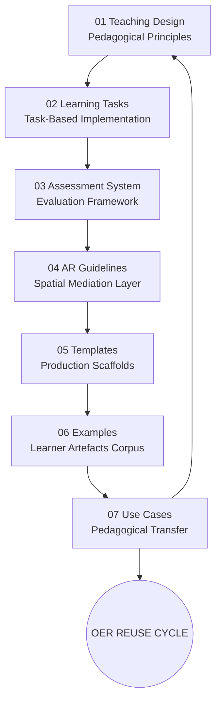

# 🌍 Urban Linguistic Landscape OER  
## Task- and Project-Based Chinese Learning (A1–A2)

---

## 🧭 Overview

This repository presents a research-based Open Educational Resources (OER) system for beginner Chinese (A1–A2 CEFR level).

It integrates:

- Urban Linguistic Landscapes (ULL)
- Task- and project-based learning
- Multimodal production and mediation
- Augmented Reality (AR) as a mediational layer
- Open Educational Practices (OEP)

The system is designed as a **cyclical pedagogical architecture**, where learning design, learner activity, and research evidence are structurally interconnected.

---

## 🧠 System architecture

The repository is organised into six interconnected modules plus a theoretical foundation:

- 00 → Theory and conceptual framework  
- 01 → Teaching design (pedagogical architecture)  
- 02 → Learning tasks (implementation layer)  
- 03 → Assessment (evaluation instruments)  
- 04 → AR guidelines (spatial mediation layer)  
- 05 → Templates (reusable design scaffolds)  
- 06 → Examples (learner-generated artefacts)

---

## 🔁 System logic

The system operates as a **closed pedagogical loop**:

1. Urban input and observation  
2. Mediation and interpretation  
3. Multimodal production  
4. AR contextualisation  
5. Evaluation and reflection  
6. Open release as OER

Each cycle produces artefacts that function simultaneously as:
- learning outcomes  
- analytical data  
- reusable educational resources  

---

## 🧭 Quick navigation

### 🧠 Theory
→ [00 Theory](./00_theory/)

### 🧩 Pedagogical design
→ [01 Teaching Design](./01_teaching_design/)

### 🌍 Learning implementation
→ [02 Learning Tasks](./02_learning_tasks/)

### 📊 Evaluation
→ [03 Assessment](./03_assessment/)

### 🧭 AR mediation
→ [04 AR Guidelines](./04_ar_guidelines/)

### 🧰 Reusable templates
→ [05 Templates](./05_templates/)

### 📁 Empirical examples
→ [06 Examples](./06_examples/)

---

## 🔗 Conceptual positioning

This project contributes to research in:

- Technology-Enhanced Language Learning (TELL)  
- Task-Based Language Teaching (TBLT)  
- Open Educational Practices (OEP/OER)  
- Multimodal and mediated learning  
- Urban and situated language pedagogy  
- AR-enhanced educational design  

---

## 📌 Research foundation

The system is based on a mixed-methods educational design study exploring how urban linguistic landscapes and multimodal production can support open, reusable learning ecologies.

---

## 📄 Citation

Liu Zhou, Empar Yahui (2026).  
*Urban Linguistic Landscape OER for Task- and Project-Based Chinese Learning (A1–A2).* GitHub repository.  

---

## 🔓 License

Creative Commons Attribution-ShareAlike 4.0 International (CC BY-SA 4.0)

---

## 🧩 System statement

This repository is not a static collection of teaching materials.

It is a **living pedagogical system**, where:

- design shapes tasks  
- tasks generate evidence  
- evidence feeds evaluation  
- outputs become reusable OER  

---

## 🔁 Entry principle

You can enter the system from any module, but full understanding emerges through cyclical navigation.

Start anywhere → move across layers → return to theory.
